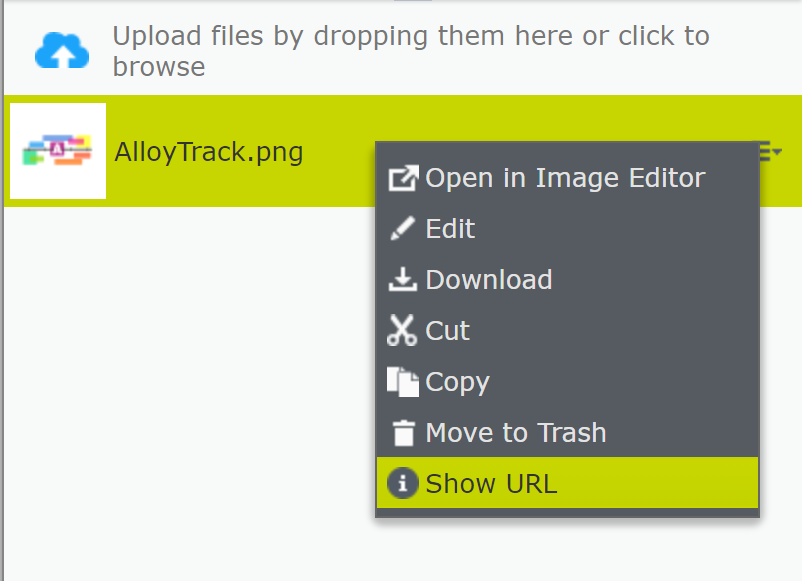
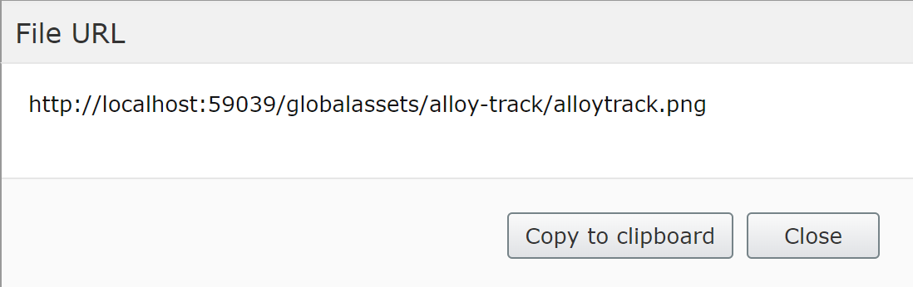
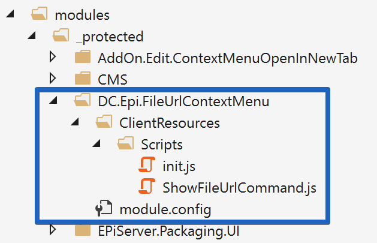

# File URL Addon for EPiServer 10+

Provides a quick and easy way to get the File URL from the edit mode.

#### Context menu

#### File URL

# Installation

Copy all files from [src](src) folder to `modules\_protected` folder in your project.

#### Visual Studio

